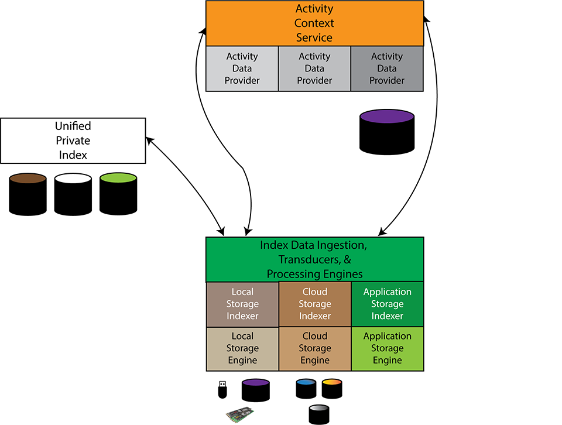

# Project Indaleko

Project Indaleko is about creating a _Unified Private Index_.  The key
characteristics of the UPI model is:

* Indexing storage in a uniform fashion, regardless of _where_ or _what_ is
  being stored.  Primarily, this means that we collect information and normalize
  it for local and cloud storage devices.

* Utilizing semantic transducers to obtain information about content.  The term
  "semantic transducer" is one introduced by Gifford in the Semantic File System
  project (SFS) in the early 1990s but remains an important concept that is used
  today for indexing systems.

* Collects and associates extrinsic information about how storage objects are
  used.  We call this extrinsic information "activity context" because it
  relates to other activities that are ongoing but correlate with storage.  For
  example, the location of the computer (and hence user) when a file is created,
  the weather conditions, websites being visited contemporaneously with file
  access and/or creation, the mood of a human user creating content, and
  interactions between human users (e.g., files you accessed while you were
  interacting with another user.)

The goal of this research artifact is to demonstrate that having a unified
private index with rich semantic and activity data provides a robust base on
which to build "personal archiving tools" that enabling easier finding of
relevant information.

## Architecture

Indaleko is designed around a modular architecture.  The goals of this
architecture are to break down processing into discrete components, both for
ease of implementation as well as flexibility in supporting a variety of
devices, storage platforms, and semantic transducers.



Logically, the project is broken down into various components:

* An **Indexer** is simply a component that identifies storage objects of
  interest.  For example, we have indexers that will look through a collection
  of local storage devices and collect basic storage information about the
  various objects stored by the storage device of interest.  There is _no
  requirement_ that the data captured be in any particular format.  A motivation
  for this is that we have found different systems return different information,
  there are subtle distinctions in how the information is represented, and while
  there is commonality amongst the metadata, there are sufficient differences
  that building a universal indexer is a complex task.  That "complex task" is,
  ultimately, one that Indaleko provides at some level.  In our current
  implementation, indexers do not interact (or minimally interact) with the
  index database.

* An **Ingester** (note, this may not be the best name) is a component that
  processes indexer output.  There is a many-to-one relationship between
  ingesters and indexers.  In our model "ingestion" is the act of taking data
  from an indexer and then extracting useful metadata from the indexer.  While
  it might seem logical to combine the indexer and ingester together - something
  we did in earlier versions - we choose to split them for similar reasons that
  we have distinct indexers.  By separating them, we allow specialized ingesters
  that can process a given indexer's output in a specific way.  For example,
  there is generally an indexer specific ingester that understands how to
  normalize the metadata captured by the indexer and then store that in the
  indexer database.  This allows us to use a common normalized model, with
  responsibility of converting the data into that normalized form, yet
  implementing it in a storage index specific fashion.  Ingesters, however, can
  also provide additional metadata.  For example, an Ingester agent could run
  one or more _semantic transducers_, elements that extract information _about
  the contents of the file._ Examples might include:
  * A machine learning based classifier that only processes videos and adds
    metadata to the index that identifies videos containing cats.
  * An EXIF data extractor, that only processes image files with embedded EXIF
    data.
  * A checksum calculator, that computes a family of common checksums for a
    given file. This can be useful for doing cross-storage device similarity
    analysis.  Some storage engines do not provide checksums, while others do.
    Even for those that do they may use a variety of different forms.  By having
    a collection of such checksums calculated for a file it becomes possible to
    identify duplicate files across dissimilar storage locations.

  Note that in each of these cases, the benefits of using a semantic transducer
  are primarily due to the proximity of the file data on the specific device.
  Once the data has been removed from the local device, such as in the case of
  cloud storage, it becomes resource intensive to fetch the files and extract
  additional metadata.
* The Indexer database.  This is the _Unified Private Index_ service.  While we
  have chosen to implement it using [ArangoDB](https://www.arangodb.com,) it
  could be implemented on other database technologies, whether in tandem or as a
  replacement.
* The activity context components.  The concept of _Activity Context_ is related
  to the observation that human activities are entwined with their use of
  storage.  At the present time, storage engines do not associate related human
  activity with storage objects.  Associating human activity with storage
  objects and storage activity is one of the key goals of Indaleko.  The
  _activity context_ aspects of Indaleko break down into multiple components:
  * An _Activity Context Service_, which can be used to obtain a handle to the
    current activity state of the system. Thus, any other component can request
    a current activity context and then associate that activity context with the
    storage object.  It is also possible for this to be done _post factum_ by
    asking for an activity context handle relative to a given point in time.
    Thus, for example, an Ingester could query for a time-relative activity
    context handle to associate with the storage event at a later time than the
    actual event.  Of course, there may not be any such context available, such
    as if the file pre-dates the activity context.
  * An _Activity Data Provider_, which is a component that provides data to the
    Activity Context Service.  These are decoupled to allow flexibility in
    capturing activity data.  Our goal is to allow these to be easily
    constructed so that we can easily test out the benefits of having various
    types of activity information.  Examples of activity data include:
    * The location of the device (and thus, by inference, the _user_ of that
      device.)
    * The ambient conditions in which the device (and again, by inference the
      _user_ of that device,) is located.
    * Computer state at a given point in time.  This might include the running
      application(s), the network connections active, etc.
    * Interactions between the user and other people.  For example, this could
      be inferred via the user's calendar, or the communications mechanisms they
      employ, such as e-mail communications, chats on commonly used services
      such as Slack, Teams, Discord, WhatsApp, etc.
    * Storage events, such as file creation, access.
    * Web usage, such as websites visited.
    * Music being played by the device.
    * The mood of the user (there's been a fair bit of work in this area.  Here
      is a [Medium
      Article](https://medium.com/analytics-vidhya/building-a-real-time-emotion-detector-towards-machine-with-e-q-c20b17f89220)
      that describes how to do this, for example.)
    * Etc.

    Indaleko does not define _what_ that activity data is, but rather provides a
    framework for capturing it and utilizing it to find human-related
    associations with storage objects.  While we know that such data is useful
    in augmenting persona data search (see [Searching Heterogeneous Personal
    Data](https://rucore.libraries.rutgers.edu/rutgers-lib/61974/PDF/1/play/)
    for example.) we do not know what the full range of such data that could be
    useful is.  Thus, this model encourages the development and evaluation of
    such activity data source providers.

## Design

The current project design is focused around evaluating the practicality and
efficacy of whether or not we can improve "finding" of relevant digital data in
a systematic fashion that works across user devices in a dynamic storage
environment that mixes local devices with cloud storage _and_ application
quasi-storage.  The architecture reflects much on the design philosophy of
modular components, with easy extensibility.

## Implementation

The current implementation consists primarily of a collection of Python scripts
that interact with an Arango database.  While in prior work we used a mixture of
languages, we chose Python for the current iteration because it provided a
robust model for constructing our prototype.

### Class model

The implementation is organized around a set of classes. The fundamental class
associated with information stored in the database is the
[Record](IndalekoRecord.py) class, which defines a small amount of information
that should be present in everything we store in the database, which includes
original captured data (the "raw data,") attributes extracted directly or
indirectly (the "attributes,") the _source_ of the information (a UUID
identifier and a version number,) and a timestamp of when the relevant
information was captured.

The components map to various elements of the architecture:

* The [Indexer](IndalekoIndexer.py) provides a general model for indexing data.
  Each system - and even specific storage types - can then construct a
  specialized indexer on top of this. This breakdown is a cross-product of the
  systems on which the Indexer runs and the storage engine that is being
  indexed.  Broadly speaking, indexing works for:
  * Local storage. This is platform dependent and may even vary based upon the
    _type_ of storage data (e.g., EXT4, NTFS, FAT, UDFS, etc.)
  * Cloud storage.  This is usually more platform _independent_.  Examples of
    this would include Google Drive, Dropbox, OneDrive, and iCloud.
  * Application storage.  At present we have not implemented any indexers for
    application storage, though we expect to do so in the future.
* The [Ingester](IndalekoIngester.py) provides a general model for transforming
  index data into useful metadata that can then be stored in the database.
  These are typically specialized to the index source, but may also have some
  platform dependencies.
* The [Services](IndalekoServices.py) provide an extensible registration and
  lookup service to track the various components that add data to the database.
* The [Database](IndalekoDBConfig.py) and [Collections](IndalekoCollections.py)
  work together to provide basic access to the ArangoDB database we are using.
* The [Machine Configuration](IndakeloMachineConfig.py) support, which is used
  for capturing and storing machine information in the database.  These are
  typically specialized to a given platform.
* The [Relationship](IndalekoRelationship.py) support, which is used to create
  associations between storage objects and other elements of the system.  For
  example, the parent/child relationship of hierarchical storage can be captured
  here, but also associations of files with their storage locations can also be
  captured. Any other relationship(s) that turn out to be useful to capture can
  also be added via specialization.

This prototype system is still under active development.  It would be surprising
if it does not continue to change as the project moves forward.

Last Updated: January 16, 2024

## How to use Indaleko?

In this section, we'll talk about how to set up your system to use Indaleko.
The process is a combination of manual and automated steps.

### Install Pre-requisites

Things you should have installed:

* **Docker** this is needed because we use ArangoDB and run it in a
  containerized environment.  The _data_ is stored on the local host system.
  While it is possible to configure this to use a remote database, that step is
  not presently automated.

* **Python** this is needed to run the Indaleko scripts.  Note there are a
  number of libraries that need to be installed.  There is a `requirements.txt`
  file that captures the current configuration that we have been using, though
  it may work with other versions of the various libraries.  It is distinctly
  possible we've added some dependency and failed to capture it in the
  requirements.txt file, in which case, please open an issue and/or a pull
  request.

* **Powershell** _this is Windows Only_.  There is a powershell script that
  gathers configuration information about your Windows machine.  It requires
  elevation ("administrative privileges") and you must enable running powershell
  scripts (which is disabled by default.)  The script writes data into the
  `config` directory, where it is then parsed and extracted by the setup
  scripts.

* **ArangoDB Client Tools** In order to upload the files into Arango, you need
  to install the ArangoDB client tools on your system.  There are versions for
  Windows, MacOS X, and Linux.  **Note:** you should _not_ run the ArangoDB
  database locally.  Keep it in the container to minimize compatibility issues.
  This may require manually disabling it (this was required on Windows, for
  example.)

### Set up the database

The `dbsetup.py` script will set up the database.  It generates a config file
that is stored in the `config` directory.  **Note that this file is a sensitive
file and will not be checked into git by default (it is in `.gitignore`).  If
you lose this file, you will need to reset your database.

This script will pull the most recent version of the ArangoDB docker image,
provision a shared volume for storing the database, create a random password for
the root account, _which is stored in the config file_. It also creates an
Indaleko account, with a separate password that only has access to the Indaleko
database.  It will create the various collections used by Indaleko, including
the various schema.

To look at the various options for this script, you can use the `--help`
command.  By default this script tries to "do the right thing" when you first
invoke it (part of our philosophy of making the tool easiest to use for new
users.)

You can confirm the database is set up and running by accessing your
[ArangoDB](http://localhost:8529) local database connection.  You can extract
the password from the `indaleko-db-config.ini` file, which is located in the
`config` directory by default.  **Do not** distribute this file.  It contains
passwords for your database.

### Set up your machine configuration

Note that there are currently three platforms we are supporting:

* Windows - this has been used on Windows 11.
* MacOS X - this has been used on MacOS X, though that work is still in
  progress.
* Linux - this has been used on Ubuntu 22.04, though that work is still in
  progress.

The following sections will describe how to configure the various systems.

#### Windows

There are multiple steps required to set up Indaleko on your Windows machine.
Assuming you have installed the database, you should be able to index and ingest
the data on your local machine.

##### Capture System Configuration

Capturing the system configuration on Windows is done using the powershell
script [`windows-hardware-info.ps1`](windows-hardware-info.ps1), which must be
run with administrative privileges (the script is explicitly set to require
this, since some of the commands fail otherwise).  There are many resources
available for explaining this.  Here is a video [3 easy ways to run Windows
Powershell as admin on Windows 10 and
11](https://www.youtube.com/watch?v=3IKQ0PwIAdo) but it's certainly not the only
resource.

**Note:** the output is written into the `config` directory, which is **not
saved** to git (the entire directory is excluded in `.gitignore`).  While you
can override this, this is **not recommended** due to the sensitive information
captured by this script.

Once you have captured your configuration information, you can run the Python script
`IndalekoWindowsMachineConfig.py`.  This script will locate and parse the file
that was saved by the Powershell script and insert it into the database.

The script has various override options, but aims to "do the right thing" if you
run it without arguments.  To see the arguments, you can use the `--help` option.

##### Index Your Storage

Once your machine configuration has been saved, you can begin creating data
index files.  This is done by executing the Python script
`IndalekoWindowsLocalIndexer.py` using your installed version of Python.

By default, this will index your home directory, which is usually something like
`C:\Users\MyName`.  If you want to override this you can use the `--path`
option.  You can see all of the override options by using the `--help` command.

This script will write the output index file to the `data` directory. Note that
this directory is **excluded from checkin to git** by default as it is listed in
the `.gitignore` file.  Logs (if any) will be (by default) written to the 'logs'
directory.

Without any options given, it will write the file with a structured name that
includes the platform, machine id, volume id, and the timestamp of when the data
was captured.

The index data can be used in subsequent ingestion steps.

##### Process Your Storage Indexing

An _ingester_ is an agent that takes the indexing data you have previously
captured and then performs additional analysis on it.  This is the step that
loads data into the database.  As of this writing, there is only a single
ingester written for Windows, which is the script
`IndalekoWindowsLocalIngester.py`.  This script knows the format of the index
file output, retrieves it, normalizes data that was captured by the indexer, and
then writes out the resulting data.

By default, it will take one of the data files (ideally the most recent) and
ingest it.  The _output_ of this is a set of files that can be manually loaded
into the database. The files generated have long names, but those names capture
information about the ingested data.  Note that the timestamp of the output file
will match the timestamp of the index file unless you override it.

There are many override options.  To see your options you can use the `--help`
command.  This command will also show you which file it will ingest unless you
override it.

While the ingestion script does write a small amount of data to the database, it
is writing to intermediate files in order to allow bulk uploading.  The bulk
uploader requires the `arangoimport` tool, which was installed with the ArangoDB
Client tools package.

There are two output files, one represents file and directory metadata.  This is
uploaded to the `Objects` collection, which must be specified on the command
line.

`arangoimport -c Objects <name of file with metadata>.jsonl`

We use the json lines format for these files.  Depending upon the size of your
file, this uploading process can take considerable time.

The second file represents the relationships between the objects and this is
uploaded to the `Relationships` collection, which also must be specified on the
command line.  Note that these collections should already exist inside the
Arango database.

`arangoimport -c Relationships <name of file with metadata>.jsonl`

The `arangoimport` tool will tell you how many objects were successfully
inserted.  This should show no errors or warnings.  If it does, there is an
issue and it will need to be resolved before using the rest of the Indaleko
facilities.

#### MacOS

This section describes how to set up Indaleko on MacOS X.

##### Capture System Configuration

Run `MacHardwareInfoGenerator.py` to get the config your mac. It is saved in the `.config` directory. It saves the meta-data about your Mac including the name and size of the volumes, hardware info, etc.

```python
python MacHardwareInfoGenerator.py -d ./config
```

The output will be saved inside the `config` directory with this name pattern `macos-hardware-info-[GUID]-[TIMESTAMP].json`. The following is a sample of what you should see:

```json
{
    "MachineGuid": "74457f40-621b-444b-950b-21d8b943b28e",
    "OperatingSystem": {
        "Caption": "macOS",
        "OSArchitecture": "arm64",
        "Version": "20.6.0"
    },
    "CPU": {
        "Name": "arm",
        "Cores": 8
    },
    "VolumeInfo": [
        {
            "UniqueId": "/dev/disk3s1s1",
            "VolumeName": "disk3s1s1",
            "Size": "228.27 GB",
            "Filesystem": "apfs"
        },
        {
            "UniqueId": "/dev/disk3s6",
            "VolumeName": "disk3s6",
            "Size": "228.27 GB",
            "Filesystem": "apfs"
        }
    ]
}
```

#### Index Your Storage

Once you have captured the configuration, the first step is to index your storage.

#### Process Your Storage Indexing

This is the process we call _ingestion_, which takes the raw indexing data,
normalizes it, and captures it into files that can be bulk uploaded into the
database.  Future versions may automate more of this pipeline.


#### Linux

