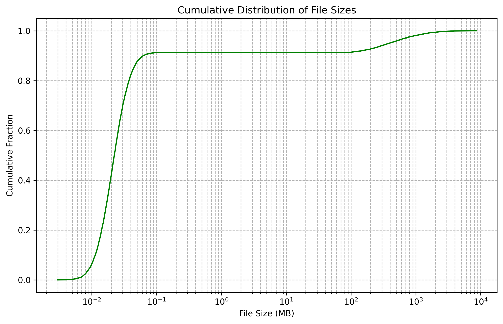

**Synthetic Data Generation Tool for UPI Evaluation**

**Objective:**
The main goal of this project is to create a synthetic data generation tool that will produce: (1) a set of files and directories; and (2) a set of files that match against a given set of queries. These will serve as a benchmark to evaluate the effectiveness of the Unified Personal Index (UPI) system. The dataset will help us measure two key information retrieval metrics: **precision** and **recall**.

**Precision and Recall:**
- **Precision**: This measures how accurate our search results are. Specifically, it is the ratio of **relevant files retrieved** to the **total files retrieved**.
- **Recall**: This measures how well our system retrieves all relevant files. It is the ratio of **relevant files retrieved** to **all possible relevant files**.

**Tool Workflow Overview:**

1. **Configuration Setup**:
   - The tool will start with a configuration file, which contains the following information:
     - **Target Size**: The total dataset size, including the number of files and/or the total storage size (e.g., "Generate at least **30,000 files** occupying approximately **30 GB**").
     - **Number of Queries**: Start with at least **5 queries** and at most **20 queries**. This gives us a variety of cases to evaluate precision and recall effectively.
     - **Matching Files per Query**: Each query should match **between 1 to 3 files**. This means that for each search query, we will generate a small number of files that match that query.
     - **Empty Queries**: Include at least **one query** that is expected to return no results to test the system’s handling of queries without matches.

2. **Synthetic Data Generation**:
   - The tool will create a set of files and directories using an **oracular construction technique**. This technique aims to perfectly control what files match specific queries and which ones do not, ensuring precise evaluation.

3. **Oracular Construction Process**:
   - **Step 1**: **Create a File for Each Query**:
     - For each query in the configuration, generate specific files that satisfy the query.
     - The tool will **upload** the file to a search evaluation tool, such as **ElasticSearch**, where it will be indexed.
     - The query will then be translated into an **actionable query for ElasticSearch** using the same process as the UPI system.
     - After running the query on ElasticSearch, the tool will check if the newly created file matches correctly.
   - **Step 2**: **Verify Uniqueness**:
     - For subsequent queries, the tool must ensure that the files created to match those new queries do **not** match any **previous queries**. This ensures we have precise control over which files are matched for which queries.
   - **Step 3**: **Add Filler Files**:
     - Once all the files have been created for the given queries, the tool will generate additional "filler" files.
     - These filler files are designed **not to match any of the queries**. The purpose is to reach the **target size** of the dataset specified in the configuration.

4. **File Characteristics**:
   - **File Types**: Generate a mix of **text files, images, and PDFs** to simulate a diverse dataset.
   - **File Sizes**: Files should range from **1 KB to 1 MB** to simulate real-world storage conditions.
   - **File Content**: Files should have **content related to the query terms** where applicable. For filler files, use **randomized text** or generic content.

5. **Freezing the Dataset**:
   - Once the entire dataset is generated, we will validate it to ensure it has **perfect precision and recall**—meaning all relevant files are retrieved by their intended queries, and no irrelevant files are retrieved.
   - The dataset will then be **frozen**, which means it will be saved in a state that can be reused multiple times for evaluation without modifications, such as by creating a git repository where we can store it.

6. **Testing Across Various Storage Services**:
   - The frozen dataset can be placed into different types of storage, such as:
     - **Local file systems** (e.g., on your computer).
     - **Cloud storage** (e.g., Google Drive, Dropbox).
     - **Alternative storage mechanisms**, such as:
       - Files sent as **email attachments**.
       - Files uploaded to **messaging services** (e.g., Discord).

7. **Evaluation Criteria**:
   - **Precision and Recall Validation**:
     - To evaluate **recall**, run each query and verify that **all expected files** are retrieved.
     - For **precision**, ensure that **only the intended files** match each query, with no false positives.
   - **Evaluation Tools**: Use **Python scripts** to automate the validation process, ensuring consistency across different storage systems.  
   - **Note**: it is distinctly possible (based upon prior work) that different storage engine level searches will return different results. In cases where the results vary, it is important that we can capture those variations for analysis.

8. **Clear Milestones and Deliverables**:
   - **Phases of the Project**:
     - **Phase 1**: Develop the configuration and synthetic file generation logic.
     - **Phase 2**: Implement the oracular construction for queries and verify uniqueness.
     - **Phase 3**: Validate precision and recall.
     - **Phase 4**: Freeze the dataset and prepare it for different storage systems.
   - **Deliverables**:
     - By the end of Phase 1, deliver a **configuration file template** and **code that generates a basic set of files and directories**.
     - By the end of Phase 4, deliver a **frozen dataset** ready for use in multiple storage environments.

9. **Examples**:
   - **Example Query**: "Show me files about my personal budget."
      - Configuration might be to create 4-10 files in 3-6 different formats (rtf, txt, xlsx, docx, csv, and pdf).
      - Matching elements might be in the content, metadata, or title.
      - Confounding elements, e.g., documents that are about budget, but not _personal_ budget.
   - **Example Query**: "Show me files that I created on August 16, 2021".
      - Configuration might be to create 3-6 files in a random collection of formats.
      - Matching elements might be in the content, metadata, or title.
      - Confounding elements, e.g., files that were created the day before, or after.
   - **Example Query**: "Show me pictures that I took within 10 km of home."
      - Configuration might be to create 5-10 files in a random selection of image file formats.
      - Note that images do not always contain location information, so this might be very limited in the formats and types it might identify.

**Background Resources**

To help you get started, here are some background materials that will provide context and practical knowledge relevant to the project:

1. **Foundational Paper**:
   - **“The Semantic File System” by David K. Gifford et al. (1991)**: 
     - [Link](https://dl.acm.org/doi/10.1145/108555.108561)
     - This paper is foundational to understanding the concept of organizing and searching files using descriptive metadata, which aligns well with the principles behind the UPI.

2. **ElasticSearch Resources**:
   - **Introduction to ElasticSearch**:
     - **ElasticSearch Documentation**: [https://www.elastic.co/guide/en/elasticsearch/reference/current/index.html](https://www.elastic.co/guide/en/elasticsearch/reference/current/index.html)
     - **Online Tutorial**: Look for beginner-friendly tutorials, such as those available on **YouTube** or **Udemy**, which provide practical examples on setting up and running queries in ElasticSearch.
     - These resources will help you understand how ElasticSearch works, including indexing and querying.

3. **Information Retrieval and Personal Information Management (PIM)**:
   - **"[Introduction to Information Retrieval](https://nlp.stanford.edu/IR-book/)" by Christopher D. Manning, Prabhakar Raghavan, and Hinrich Schütze**
     - This book is widely regarded as a modern, comprehensive reference for information retrieval, focusing on:
        - Indexing methods
        - Compression techniques
        -  Search engines
        - Natural language processing for search 
   - **“[Personal Information Management](https://arxiv.org/pdf/2107.03291)” edited by William Jones and Jaime Teevan**:
     - This book provides an overview of the challenges and techniques used in organizing and retrieving personal information, which will help you understand the value of systems like the UPI.

4. **Python Libraries and Tools for the Project**:
   - **File and Directory Generation**:
     - **os, pathlib, and shutil**: These are standard Python libraries that are essential for creating and managing files and directories.
     - **Faker**: [https://faker.readthedocs.io/](https://faker.readthedocs.io/)
       - A Python package that generates fake data, useful for creating realistic file contents, names, etc.
   - **ElasticSearch Interaction**:
     - **elasticsearch-py**: [https://elasticsearch-py.readthedocs.io/](https://elasticsearch-py.readthedocs.io/)
       - The official low-level Python client for interacting with ElasticSearch.

5. **Video Content and Online Courses**:
   - **YouTube Channels** like **“Corey Schafer”** and **“Traversy Media”** offer excellent beginner-to-advanced Python tutorials.
   - **ElasticSearch Basics on Udemy or Coursera**: Look for short courses that provide hands-on experience with ElasticSearch.

6. **File sizes and their distribution**
  - See [File Size Distribution Visualization](./figures/file_size_distrbution_viz.py) for a description of background information, as well as various data visualizations of file size distribution.
  - File size distribution is heavily skewed towards small files: 
  
  - Files generated in the synthetic data set should have a similar distribution.

**Goals for UGRA**:
1. **Understand the Tool's Purpose**: This tool helps us objectively measure how well our UPI system finds files by comparing it with a dataset where we **know exactly** which files should match which queries.
  - Note: "know exactly" implies that the underlying tools are themselves perfect, which may not be the case.  This is why it is important the tool tells us which files matched, so that we can then analyze them.  Our "oracle" might not be infallible.
2. **Write the Synthetic Data Generation Logic**:
   - Build a program that takes a configuration file and generates files that match specific criteria.
   - Ensure files are indexed in a search engine (like ElasticSearch) and that queries can be run against it.
3. **Validate the Dataset**: Make sure that the files and directories generated have **perfect recall and precision**.
4. **Prepare the Dataset for Testing in Multiple Storage Systems**: Once the dataset is validated, it will be used for tests in a variety of environments to ensure the UPI system works effectively everywhere.

**Next Steps**:
- Start by familiarizing yourself with the configuration setup and understanding the required dataset properties.
- Work on building the data generation logic, ensuring it can create files that are correctly indexed and matched by ElasticSearch.
- We can collaborate closely during each phase—feel free to ask questions as you start implementing the steps outlined here.