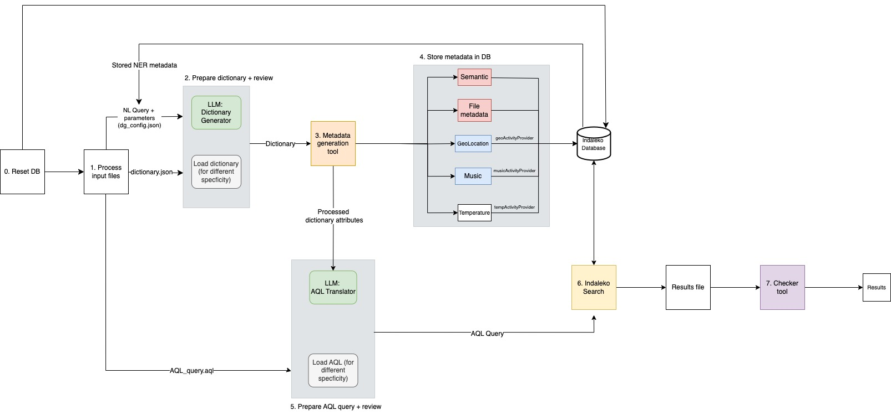

# Workflow of Pipeline



## Set Up Instructions:
To run the pipeline, ensure that you have access to an OpenAI API key. 
Store the secret key in the `Indaleko/config/openai-key.ini` file in the format:
```
[openai] 
api_key = your-secret-key
```

If not already installed, install:
* [Geopy](https://geopy.readthedocs.io/en/stable/)
  ```sh
  pip install geopy
  ```
* [Faker](https://faker.readthedocs.io/en/master/)
  ```sh
  pip install Faker
  ```
* [click](https://pypi.org/project/click/)
  ```sh
  pip install click
  ```

## Running the Pipeline:
### Running on Mac

#### Step 1: Reset the Database

```sh 
# Reset the database:
python ./db/db_config.py reset
# Add machine configuration file for appropriate OS:
python ./platforms/mac/machine_config.py --add
# Import local files into the ArrangoDB based on OS:
python ./storage/recorders/local/mac/recorder.py --arangoimport
```

#### Step 2: Generate Data
``` sh
* Run the data generator:
python ./data_generator/main_pipeline.py
  ```

### Running on Windows:
```sh
python .\db\db_config.py reset
python .\platforms\windows\machine_config.py --add
python .\storage\recorders\local\windows\recorder.py --arangoimport
python .\data_generator\main_pipeline.py
```

### Running on Linux:
```sh
python ./db/db_config.py reset
python ./platforms/linux/machine_config.py --add
python ./storage/recorders/local/linux/recorder.py --arangoimport
python ./data_generator/main_pipeline.py
```

## Running a Query for the First Time:
1. Change any parameters within `/config/dg_config.json`.
2. Type 1 to generate new dictionary when prompted. Check dictionary and type 1 for data generation.
3. Type 1 to generate new AQL when prompted. Check AQL with reference to `/config/query_info.json` and type 1 when ready.
4. View progress using `/results/validator_progress.log` and the final results in `/results/validator_result.log`.
5. To see all the data generated, refer to `/results/stored_metadata/` or `/results/Indaleko_search_result.json` for the queried objects.

## Running a Query with Different Selectivity:
1. Change only the 'n_matching_queries' parameter in `/config/dg_config.json`.
2. Type 0 to generate dataset from the previous dictionary made.
3. Type 0 to use previous AQL, this should show an updated list of dynamic collections in query_info.json. 4. Update any activity collection names using the `/config/query_info.json file`.
5. Type 1 to submit query when ready.
6. View progress using `/results/validator_progress.log` and the final results in `/results/validator_result.log`.
5. To see all the metadata generated, refer to `/results/stored_metadata/` or `/results/Indaleko_search_result.json` for a list of queried objects.

## Script Locations
- **Indaleko/data_generator/s1_metadata_generator.py**  
  Creates the metadata with the given config file.
- **Indaleko/data_generator/s2_store_metadata.py**  
  Directly uploads the metadata to the Indaleko DB.
- **Indaleko/data_generator/s3_translate_query.py**  
  Translates the NL query into an input suitable for data generator (formatted dictionary).
- **Indaleko/data_generator/s4_translate_AQL.py**  
  Translates the dictionary into an AQL statement.
- **Indaleko/data_generator/s5_get_precision_and_recall.py**  
  Calculates precision and recall of the resulting Indaleko search.
- **Indaleko/data_generator/s6_log_result.py**  
  Logs the progress of the pipeline workflow, including epoch time, outputs, and any errors. Outputs final result and progress log files.
- **Indaleko/metadata**  
  Consists of scripts for the metadata generation for `s1_metadata_generator.py`.

## Metadata Generation Workflow

### Config Processor
Extracts parameters specified by the user in the config file:
- **Output_json**: Location of output.
- **N_metadata_records**: Total number of records to create.
- **N_matching_queries**: Total number of truth metadata to create from the total.
- **Query**: The NL query.

### Prepare Dictionary + Review
- Users can choose to use an already populated `/config/dictionary.json` or generate a new dictionary with LLM assistance.
- Manual review is possible.

### Metadata Generation
- Generates truth and filler metadata.
- A single metatdata generated should have an object in all of the collections below:
1. Objects
2. SemanticData
3. 3 dynamically created collections

### Store Metadata
- Outputs are uploaded directly to the Indaleko DB.
- **Records & SemanticData**: Stored statically.
- **3 Activity metadata**: A dynamic activity provider is created and stored dynamically.


### Prepare AQL + Review
- Users can select a previously used AQL statement from `AQL_query.aql` or generate a new one via LLM.
- Manual review is required using `query_info.json`.

### Run Indaleko Search
- Executes the AQL query within the Indaleko search system.

### Checker Tool
- Computes search results into **precision** and **recall** scores.
- **Note**: Precision and recall are only relevant for files generated with the data generator.

## Outputs of the Metadata Generator

Stored in the database and used for querying:
- **`results/validator_progress.log`**: Logs workflow progress.
- **`results/validator_result.log`**: Summary of search results.
- **`results/Indaleko_search_result.json`**: Data returned by the search.
- **`results/stored_metadata`**: JSON files for different metadata types:
  - **Posix (Record)**
  - **Semantics**
  - **Geographical location**
  - **Ecobee temperature**
  - **Ambient music Activity metadata**
  - **Machine config files**

Each JSON file contains lists of dictionaries where each entry represents a metadata record conforming to data models provided in the repository.